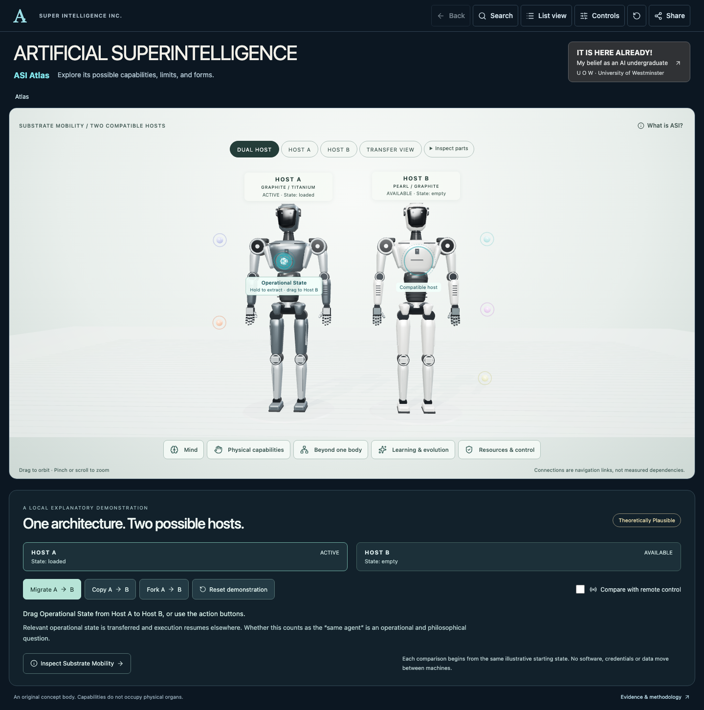

# Artificial Superintelligence · ASI Atlas

An explorable portrait of possible superintelligence: its capabilities, limits and forms. Two original industrial humanoid hosts demonstrate migration, copying, forking and remote control. Five discovery groups connect the exhibit to the full capability atlas. Choose a capability, follow a subtopic, try an illustrative scenario or inspect the evidence behind a claim.



**IT IS HERE ALREADY!** is prominently attributed as the creator's personal belief as an AI undergraduate at **U O W · University of Westminster**. It replaces the earlier arrival window and is not presented as an established scientific finding. All project measurements remain **Not measured for this project.** AI need not be humanoid, and abstract capabilities do not occupy physical organs.

## Run

Node **22.13.0+**; tested with Node 24.18.0 and npm 11.16.0. React, TypeScript, Vite and direct Three.js; no backend, keys, model calls or external visual assets.

```sh
npm ci
npm run dev
# http://127.0.0.1:3016
npm run check
npm test
npm run build
npm run preview
# http://127.0.0.1:4173
```

Both servers bind to loopback and use strict ports. Install Chromium once, then test the built preview:

```sh
npx playwright install chromium
npm run test:e2e
E2E_DEV=1 npm run test:e2e
npm run size
node scripts/measure-preview.mjs
```

## Explore

- Drag **Operational State** from Host A into Host B, or use **Migrate A → B**, **Copy A → B**, and **Fork A → B**. Remote control keeps the state on A. Reset begins a new comparison from the same illustrative starting state. **Dual host / Host A / Host B / Transfer view** and **Inspect parts** frame the platform.
- Choose **Mind**, **Physical capabilities**, **Beyond one body**, **Learning & evolution** or **Resources & control**. The orbs are real Three.js objects; their HTML labels are keyboard-operable and wrap on compact screens.
- Select robot geometry, a cloud or a result in **Search / List view**. Every route uses the same reducer. The inspector opens beside the scene on desktop and as a bottom sheet on narrow screens.
- Each of the twelve dossiers has five explorable subtopics, mechanisms, prerequisites, limits, a worked scenario, open questions, source scope and proposed measurement. The overview resets when another capability opens.
- Try **Strength depends on the body**, step through **Precision is a feedback loop**, or compare **Remote control / Migration / Copying**. These local illustrations highlight context and execution arrangements; they are not validated simulations or external control tools.
- Use **Back / Escape** one level at a time, or **Reset** to return home with default layers and camera. **Controls** contains camera presets, zoom, conceptual separation, layers and status-accent colours. The graphite and pearl body materials remain distinct.
- **Share** includes group, capability, profile, subtopic, illustration conditions, layers, filters, finish and camera. Version 3 also restores the chosen host view and completed transfer comparison. Versions 1 and 2 remain readable; in-progress transfers reopen safely at their starting state. Clipboard failure leaves a selectable link.
- **List view** provides all content without WebGL. Sources and measurements remain HTML. Network and Evolution are explicitly planned future views, available under Controls.

## Architecture

| Concern                                                           | Location                                              |
| ----------------------------------------------------------------- | ----------------------------------------------------- |
| Twelve stable records, evidence and source scope                  | `src/data/capabilities.ts`, `schema.ts`, `sources.ts` |
| Discovery groups and profile links                                | `src/data/discovery.ts`, `profile.ts`                 |
| Main dossier depth and connected subtopics                        | `src/data/dossiers.ts`                                |
| Illustration steps and conditional execution state                | `src/data/illustrations.ts`                           |
| Arrival scenario and provenance                                   | `src/content/arrival.ts`                              |
| Unified selection, navigation, URL migration and history          | `src/state/`                                          |
| Original body, orbs, hosts, picking, fitting and label placement  | `src/scene/`                                          |
| Accessible catalogue, inspector, illustrations and modal controls | `src/components/`                                     |

The renderer runs on changes and during the finite transfer animation, without automatic orbit or an idle animation loop. Default camera fitting uses visible body bounds, excluding the floor and discovery nodes. Scene and inspector occupy separate layout regions. Geometry, materials, environment textures, shadows, observers, controls and listeners are disposed on unmount. Optional feature-detected WebMCP tools use the same selection reducer.

## Content and provenance

The twelve main dossiers contain **3,444 words**, with **2,431 more across 60 subtopics**: about **3,982 net additional overview/subtopic words** compared with the previous inspector. Main dossiers individually contain 270–306 words; evidence, measurement and fourteen qualitative profiles are additional. See [content-depth.json](docs/content-depth.json) for the counting method.

Observed, Extrapolated, Theoretically Plausible and Speculative remain separate. Three narrow observations were rechecked against primary paper abstracts; no experiments or robot records were reproduced. See [source review](docs/SOURCE_REVIEW.md) and the [content guide](docs/CONTENT_GUIDE.md). Memory and Control and Governance remain provisional navigation groupings.

All robot, cloud and host geometry is original project code. No stock references, watermarks, purchased model files or generated flat robot images are shipped. The small Human Atlas MIT PointerTap helper retains its attribution; no anatomy assets or upstream history are distributed. See [asset ledger](ASSET_LICENSES.md), [reference inspection](docs/REFERENCE_INSPECTION.md) and [third-party notices](THIRD_PARTY_NOTICES.md).

## Handoff

The [dual-host implementation report](docs/DUAL_HOST_HANDOFF.md), [handoff](docs/HANDOFF.md) and [verification report](docs/VERIFICATION.md) record implemented behaviour, actual checks and remaining limits. Screenshots compare [before](docs/screenshots/before-immersive/) and [after](docs/screenshots/after-immersive/) at desktop, mobile and landscape sizes.

The atlas is public at **[superintel.site](https://superintel.site)**, with HTTPS and no sign-in required. Public access was explicitly requested on 12 September 2026. The existing static Vite build is hosted by Sites. See [publishing notes](docs/PUBLISHING.md); deployment success and the production URL are reported by Sites. No purchases or plan changes were made.

Physical-device, Safari/Firefox, manual screen-reader and participant testing remain unperformed. The [ten-person usability protocol](docs/USABILITY_TEST.md) contains no invented results. Network/Evolution views and empirical ASI measurements remain deferred. The original research introduction is preserved in [ORIGINAL_README.md](docs/ORIGINAL_README.md).
