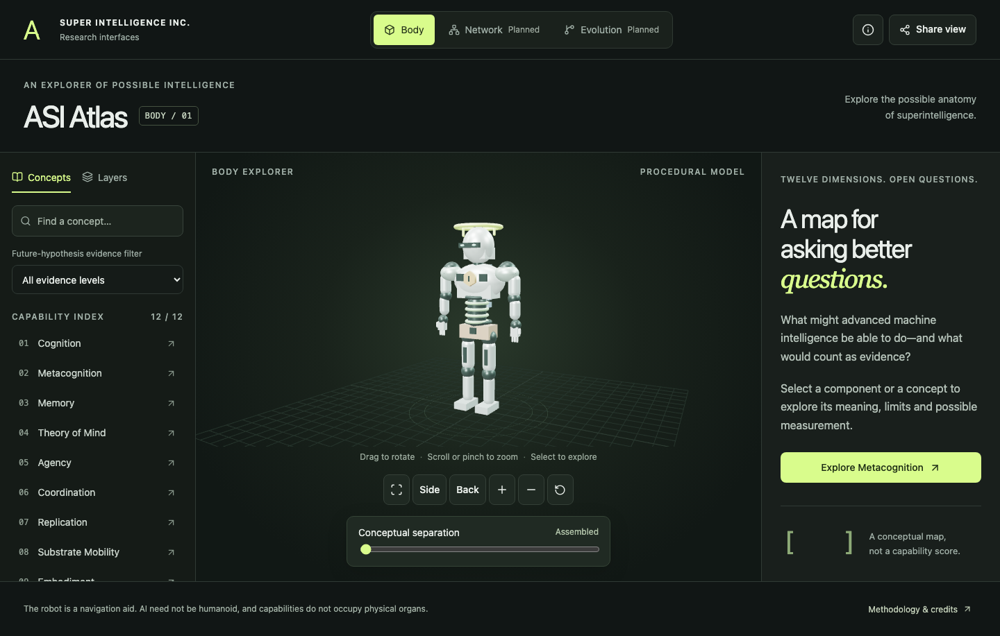

# ASI Atlas

**Super Intelligence Inc. — explore the possible anatomy of superintelligence.**

A working educational explorer built with React, TypeScript, Vite and direct Three.js. Rotate an original procedural robot, select one of twelve conceptual components, read its real capability card, isolate its context and share the view.

The robot is a navigation aid. AI need not be humanoid, and abstract capabilities do not occupy physical organs. The atlas separates future hypotheses, scoped paper-reported observations and uncollected project measurements. It does not score ASI progress.



## Run

Tested with Node **24.18.0**, npm **11.16.0**. Node must be at least **22.13.0** and compatible with the locked dependencies.

```sh
npm ci
npm run dev
```

Open **http://127.0.0.1:3016**. The server uses strict-port behaviour and binds to loopback. No API keys, backend, model calls or external assets are required.

```sh
npm run check
npm run test
npm run build
npm run preview
# Static production preview: http://127.0.0.1:4173
```

Install the test browser once and exercise the production build:

```sh
npx playwright install chromium
npm run test:e2e
# The suite starts its own static preview when necessary.
E2E_DEV=1 npm run test:e2e
npm run size
```

The package lockfile is committed. `npm ci` was actually run successfully; see [verification](docs/VERIFICATION.md) for commands, outcomes, limitations and browser coverage.

## Explore

- Drag to orbit; scroll or pinch to zoom. Explicit front, side, back and zoom controls are available.
- Select the halo for **Metacognition**, or use the HTML catalogue. All twelve groups are selectable, including in the separated arrangement.
- Read **Overview**, **Evidence**, and **Measure**. Use **Isolate context** and **Exit isolation**; **Reset explorer** restores all layers and clears filters.
- Search names, IDs, aliases, meanings and subtraits. Try “resource layers.” Search stays independent of layer visibility.
- Filter by **future-hypothesis evidence**, which is separate from source review. No future hypothesis is labelled Observed in this release; that filter correctly returns no cards.
- **Share view** copies a versioned URL containing selection, layers, isolation, separation, filters and camera. A selectable link remains available if clipboard access fails. Back and Forward restore meaningful navigation.
- Every explanation is reachable through semantic HTML controls without using WebGL. On small screens the scene and inspector are stacked, avoiding canvas/panel overlap. Sharing and methodology use native accessible modal dialogs.

**Network** and **Evolution** are explicitly labelled **Planned—not implemented.** Their intended scopes are described without fake simulations.

## Architecture

```text
src/
├── main.tsx, App.tsx
├── data/        # required schema, domains, cards, sources, visual mappings, validation
├── state/       # pure reducer, selectors, hash format, browser history, optional WebMCP
├── scene/       # original geometry, part registry, picking, camera, explode, lifecycle
├── components/  # catalogue, inspector, toolbar, evidence, roadmap, modal, UI button
├── content/     # shared evidence legend and methodology
└── styles/      # responsive atlas theme
tests/
├── unit/        # content, state, URL safety, geometry, gestures, optional tools
├── components/  # HTML catalogue and inspector
└── e2e/         # real canvas, sharing, mobile, fallback, keyboard and accessibility
```

The renderer is mounted once per Body session, including under React Strict Mode. State transitions request bounds-based fitting in a dedicated, unobstructed canvas area. Authored transforms are preserved; separation always interpolates from those transforms. Rendering is event-driven, without an idle animation loop or automatic rotation. Camera changes are debounced. Cleanup releases scene geometry, materials, environment textures, controls, observers, handlers and frames.

Optional `find_capabilities` and `inspect_capability` WebMCP tools are feature-detected; they use the same catalogue and selection action as the visible interface. Ordinary browsers do not depend on them.

## Content and provenance

There are twelve substantive cards, each with definitions, conditional examples, subtraits, distinctions, proposed measurement and evidence context. Memory and Control and Governance are marked **Provisional navigation grouping.** All project measurements are `null`: **Not measured for this project.**

Only three narrow observations are published, based on reviewed paper abstracts. They are explicitly attributed and scoped; no experiments have been reproduced. Other cards omit unsupported empirical claims and identify the review gap. See the [content guide](docs/CONTENT_GUIDE.md).

Human Atlas was inspected and run at commit `1c38bf35c254a891200d3cedecfd57abebe83d8d`. Its small MIT PointerTap helper is reused with attribution. The binary anatomy loading/rendering layer was not copied. No BodyParts3D files, upstream anatomy assets or upstream Git history are distributed. See [reference inspection](docs/REFERENCE_INSPECTION.md), [asset ledger](ASSET_LICENSES.md), [MIT licence](LICENSE) and [third-party notices](THIRD_PARTY_NOTICES.md).

## Release status

The [verification report](docs/VERIFICATION.md) records the tested engineering release. A complete [handoff](docs/HANDOFF.md) includes the actual file tree and limitations.

**Deployment blocked:** no destination hosting project/account or publication authorisation has been established. The static `dist` build and root-level Vite configuration are ready for an authorised destination. **Publishing code on GitHub and publishing the running website are separate steps.** Follow the [deployment runbook](docs/DEPLOYMENT.md); do not assume a commercial project qualifies for Vercel Hobby.

**Human usability pilot: not run.** An executable [ten-person protocol](docs/USABILITY_TEST.md) is provided. Automated viewport checks are not physical-device or human testing.

The repository's original research introduction is preserved in [ORIGINAL_README.md](docs/ORIGINAL_README.md).
