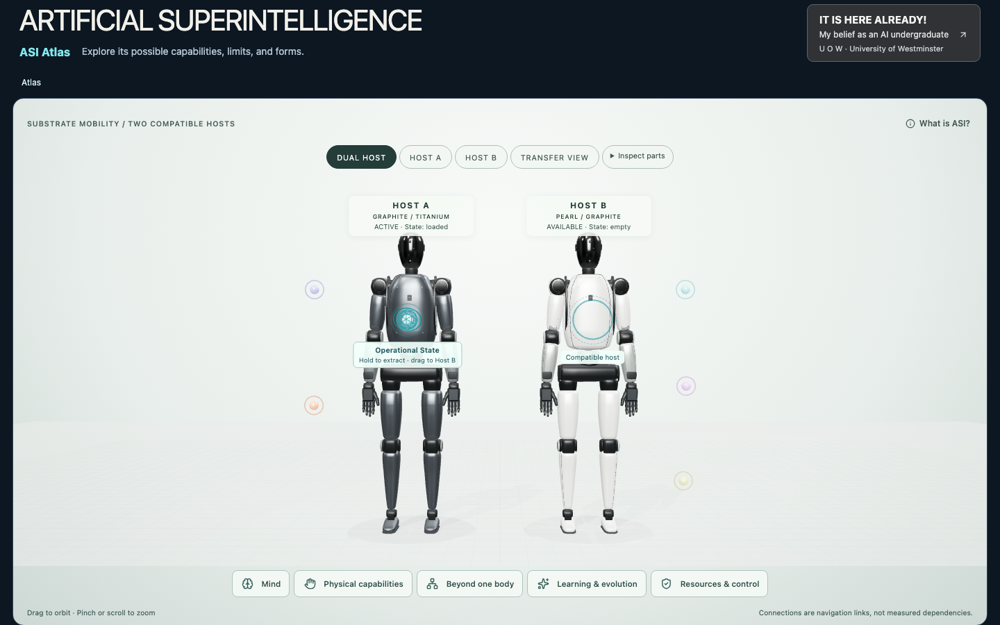

# Atlas Humanoid reconstruction · 12 September 2026

The two bodies now use one normalized, hierarchical hard-shell model. Graphite/titanium and pearl/graphite hosts share the same geometry buffers and dimensions, with independent transforms and materials. The transfer state machine, public content, charcoal belief banner, navigation and twelve capability IDs are preserved.

## Before and after

| Before | After |
| --- | --- |
|  |  |

Final review images: [Host A full body](screenshots/reconstruction/final-host-a-front.png), [three-quarter](screenshots/reconstruction/final-host-a-three-quarter.png), [close view](screenshots/reconstruction/final-host-a-close.png), [390×844 mobile](screenshots/reconstruction/final-mobile-390x844.png), [hands close-up](screenshots/reconstruction/detail-review-hands.png), [side](screenshots/reconstruction/material-07-side.png) and [back](screenshots/reconstruction/material-07-back.png). Desktop captures are 1440×900. Final UI captures include the existing operational-state overlays; development detail captures hide them to expose the surfaces.

The supplied reconstruction attachment contained text only. The mentioned photograph set was not present, and the request for its location had no answer during this pass. The visual comparison therefore used the public dark hard-shell Figure 02 [front photograph](https://www.blessthisstuff.com/imagens/stuff/figure-02-humanoid-robot-2.jpg), [three-quarter torso photograph](https://www.blessthisstuff.com/imagens/stuff/figure-02-humanoid-robot-3.jpg) and [head/hand photograph](https://www.blessthisstuff.com/imagens/stuff/figure-02-humanoid-robot-4.jpg). These were inspected as references, not bundled as assets. The normalized values below are reconstruction targets, not measured manufacturer dimensions. The brief's numerical reference-error tolerances cannot be certified against the missing original set.

## Parameter table

Standing height H = 1; the renderer maps H to 6.2 scene units. Both hosts use every value below.

| Component | Normalized dimension / H |
| --- | ---: |
| Head height / width / depth | 0.124 / 0.083 / 0.080 |
| Neck height / width | 0.043 / 0.043 |
| Overall shoulder width | 0.270 |
| Chest height / width / depth | 0.254 / 0.172 / 0.112 |
| Chest lower width | 0.143 |
| Waist height / width / depth | 0.057 / 0.076 / 0.074 |
| Pelvis width / height / depth | 0.208 / 0.061 / 0.091 |
| Upper arm joint length / shell width | 0.172 / 0.055 |
| Forearm joint length / proximal width / distal width | 0.168 / 0.052 / 0.038 |
| Hand length / palm width | 0.101 / 0.043 |
| Thigh joint length / width | 0.210 / 0.071 |
| Shin joint length / proximal width / distal width | 0.229 / 0.059 / 0.031 |
| Foot length / width / height | 0.114 / 0.047 / 0.034 |

Vertical landmarks: head top 1.000, shoulder 0.816, elbow 0.645, wrist 0.478, pelvis center 0.528, knee 0.281, ankle 0.052, floor 0.000. Arm lengths are derived from joint positions. Head height/width is 1.49; foot length/width is 2.43. The 29° vertical camera field of view produces approximately 77% body-height occupancy in dual view and 81–84% in single front/three-quarter views. See [capture measurements](screenshots/reconstruction/capture-metrics.json).

## Reconstruction and correction loop

The five largest baseline problems were the appliance-like head, dominant shoulder rings, fragmented torso/waist, thin uniform limb shells, and undersized hands/block feet. The first pass replaced these with lofted pod and torso surfaces, compact shoulder housings, a short waist and horizontal pelvis, broad tapered limbs, segmented five-digit hands and horizontal shoe lofts.

1. **Silhouette in clay:** [initial front](screenshots/reconstruction/clay-01-front.png), then [corrected front](screenshots/reconstruction/clay-02-front.png), [three-quarter](screenshots/reconstruction/clay-02-three-quarter.png) and [side](screenshots/reconstruction/clay-02-side.png). Corrected the arm-shell rotation sign, eliminated banding in loft interpolation, and corrected the raised toe profile revealed by the side view.
2. **Mechanical assembly:** [front](screenshots/reconstruction/assembly-03-front.png) and [three-quarter](screenshots/reconstruction/assembly-03-three-quarter.png). Added integrated shoulder side structures, elbow/wrist couplers, compact hip links, lateral knee actuators, ankles and finger joints. The elbow, knee and finger subassemblies belong to real joint pivots.
3. **Industrial details:** [front](screenshots/reconstruction/details-04-front.png) and [three-quarter](screenshots/reconstruction/details-04-three-quarter.png). Added chest perimeter seams, flush fasteners, lateral and arm vents, sensor apertures, distal inserts, palm pads and black soles. Repeated vent elements are merged per side.
4. **Materials and global correction:** Reviewed graphite and pearl. Enlarged the pod head to its final ratio, corrected intersecting visor skins that caused pearl-host flicker, and lowered the stage to the soles. Close-up review then caught floating forearm seam geometry; forearm and shin seams now follow actual transformed shell vertices. [Final front](screenshots/reconstruction/material-07-front.png), side/back and close-up images were reviewed after correction.

Visible shoulder faces are compact black actuators without white bullseyes. The chest is one curved shell; the abdomen has no stacked bellows. Pelvis geometry spans horizontally across the hips. Front knee geometry is a shaped hinge, with circular caps on the sides. Finger lengths differ, each main digit has three articulated segments and the thumb has two. Shin shells taper to separate ankles and low rounded shoes.

## Geometry, performance and files

Each complete body has **148,120 visible triangles**; the pair has **296,240**. This is below the preferred 150,000 per-host ceiling and the 250,000 hard ceiling. Stage, state object and discovery objects add triangles beyond the body count. Mesh buffers are shared across hosts; PBR materials are shared within each semantic part/surface and independent across hosts. Render-on-demand, pixel-ratio limits and disposal remain in place. [Build size](build-size.json) and [local preview transfer/render observations](preview-transfer.json) record the final build. Idle observation produced zero additional renders over 500 ms on both tested viewport sizes; this is not a physical-device FPS benchmark.

| Files | Responsibility |
| --- | --- |
| `src/scene/robot/robotSpec.ts` | H = 1 dimensions, landmarks, derived metrics |
| `src/scene/robot/geometry/primitives.ts` | Smooth superellipse lofts, custom shoes, tapered shells and bevelled joint profiles |
| `src/scene/robot/createRobot.ts` | Shared body construction, host cloning and separation/reassembly adapter |
| `src/scene/robot/geometry/createMechanicalAssembly.ts` | Shoulder structures, couplings and joint hardware |
| `src/scene/robot/geometry/createIndustrialDetails.ts` | Surface seams, vents, apertures, pads and soles |
| `src/scene/robot/rig/createRobotRig.ts` | Pelvis → waist → torso → head/arms; pelvis → hips → legs hierarchy |
| `src/scene/robot/materials/materialLibrary.ts` | Graphite, pearl, titanium, flexible material and glossy visor PBR palettes |
| `src/scene/robot/debug/RobotDebugOverlay.ts` | Development-only five-angle comparison, clay/assembly/detail/material stages and guides |
| `src/scene/createRobot.ts` | Compatibility re-export |
| `src/scene/RobotScene.tsx`, `camera.ts`, `partRegistry.ts` | Lighting, framing, debug lifecycle and safe updates to shared materials |
| `tests/unit/robotRig.test.ts`, existing browser suites | Hierarchy, exact reassembly, shared geometry, budgets and interaction regression |
| `scripts/capture-robot-qa.mjs`, `capture-reconstruction-final.mjs` | Reproducible staged and final screenshot capture |

Assembled visual meshes are children of the joint hierarchy. Conceptual separation temporarily reparents them into capability containers, then restores their exact local transforms and rig parents. Invisible bounds are separate from the rendered shells; picking continues against actual visible geometry, preserving all twelve IDs without inflating the silhouettes.

## Validation

- TypeScript and production build pass; **53 unit/component tests pass**.
- **32 production Chromium browser tests pass**: real mesh selection, all twelve separated groups, orbit, zoom, inspection, clouds, state dragging, migrate/copy/fork/remote control, keyboard, reduced motion, share links/history, search, fallback, cleanup, mobile and accessibility journeys.
- New unit coverage checks distal arm movement from the elbow, unaffected head position, exact restoration after separation, independent visibility, identical host bounds/bone positions and the triangle budget.
- Production does not contain the debug panel code; requesting `?robotDebug=1` on the production preview produces no panel.
- Desktop, 390×844, 320×568 and 844×390 browser captures are retained. The final front, single-host, three-quarter, close-up, side/back and 390×844 images were inspected.
- Asset transfer budgets pass. The bundled Three.js build still produces Vite's large-chunk advisory; no new dependencies or remote geometry/texture downloads were added.

## Specific remaining mismatches and limits

- The chest side ventilation and rear service area have fewer layers, recessed channels and connectors than the reference hardware. The back is a simplified central service panel.
- Pelvis and hip housings are smoother and more regular than the reference's densely integrated actuator assembly. The model does not reproduce internal drive mechanisms.
- Fingers have proper segments, pivots and pads, but their cross-sections remain more uniform than the reference's sculpted finger housings; tendon routing and small cable paths are omitted.
- The neutral standing pose remains almost symmetric. The reference photographs include subtler wrist rotation and weight distribution.
- Studio environment reflections and contact shadows are approximate. This is authored procedural product geometry, not a scan, production CAD model or engineering reconstruction. Original-reference landmark error percentages remain unverified.
- Physical-device performance, Safari/Firefox, manual screen-reader and participant testing are unperformed. The existing demo remains a local illustration of execution arrangements, with no real state migration or empirical ASI claim.
